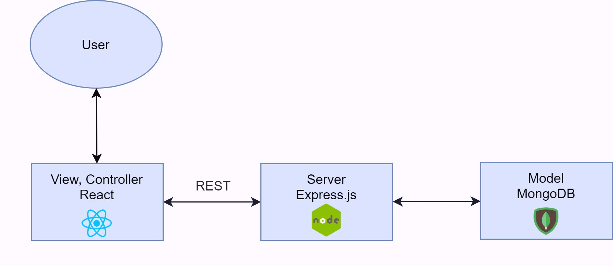
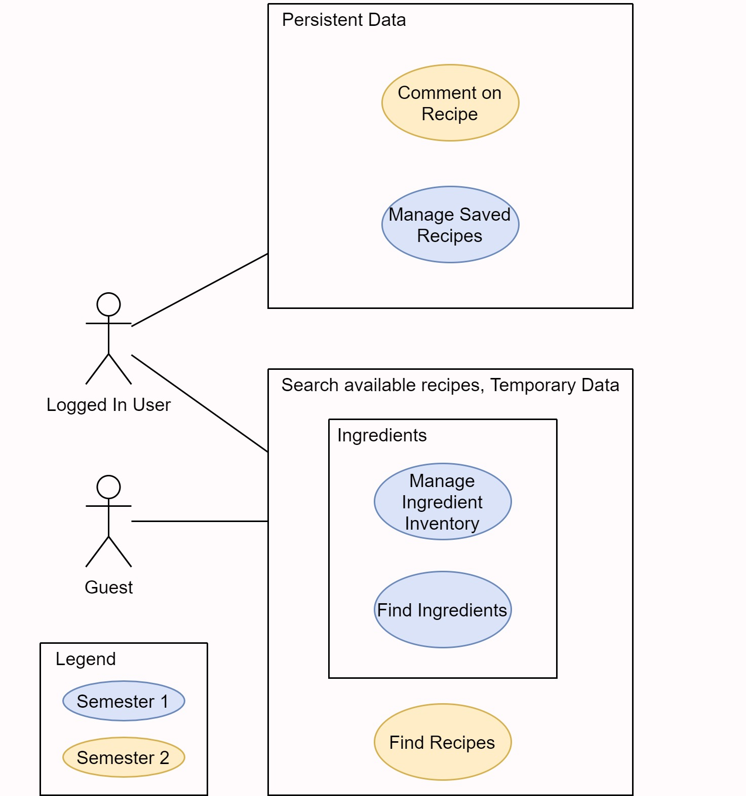
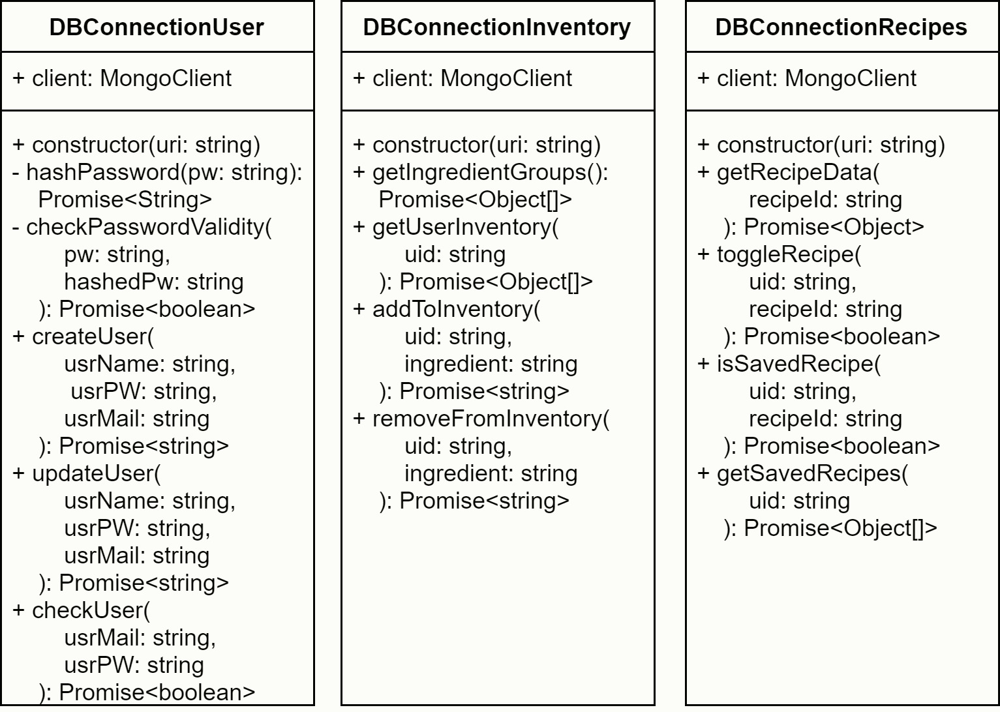
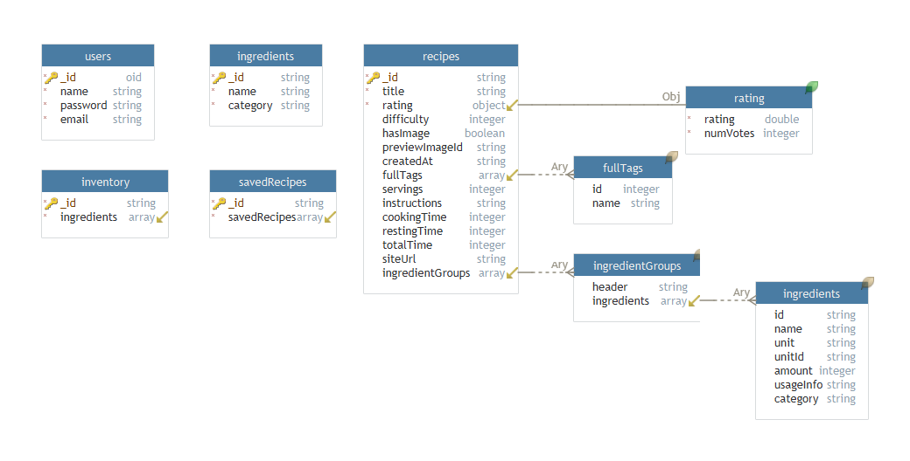

# Software Architecture Document

# Table of Contents

- [Introduction](#1-introduction)
    - [Purpose](#11-purpose)
    - [Scope](#12-scope)
    - [Definitions, Acronyms and Abbreviations](#13-definitions-acronyms-and-abbreviations)
    - [References](#14-references)
    - [Overview](#15-overview)
- [Architectural Representation](#2-architectural-representation)
- [Architectural Goals and Constraints](#3-architectural-goals-and-constraints)
- [Use-Case View](#4-use-case-view)
- [Logical View](#5-logical-view)
- [Process View](#6-process-view)
- [Deployment View](#7-deployment-view)
- [Data View](#8-data-view)
- [Size and Performance](#9-size-and-performance)
- [Quality](#10-quality)

## 1. Introduction

### 1.1 Purpose

This document provides a comprehensive architectural overview of the system, using a number of different architectural views to depict different aspects of the system. It is intended to capture and convey the significant architectural decisions which have been made on the system.

### 1.2 Scope

This document describes the technical architecture of the cooken project, including the structure of classes, modules, dependencies and database.

### 1.3 Definitions, Acronyms and Abbreviations

| Abbrevation | Description                            |
| ----------- | -------------------------------------- |
| API         | Application programming interface      |
| DB          | Database                               |
| REST        | Representational state transfer        |
| SRS         | Software Requirements Specification    |
| UC          | Use Case                               |

### 1.4 References

-  [GitHub](https://github.com/kuscu0/cooken)
-  [Blog](https://cooken264100434.wordpress.com/)
-  [SAD](SAD.md)
-  [SRS](../SRS.md)
-  [UCD](../use_case_diagram.jpg)
-  [.feature files](../features/)
-  [Use case: Comment on recipe](../UC/comment-on-recipe/UC_comment_on_recipe.md)
-  [Use case: Find ingredients](../UC/find-ingredients/UC_Find_Ingredients.md)
-  [Use case: Find recipes](../UC/find-recipes/UC_Find_Recipes.md)
-  [Use case: choose ingredients](../UC/find-ingredients/UC_Find_Ingredients.md)
-  [Use case: Manage ingredient inventory](../UC/manage-ingredient-inventory/UC_manager_saved_recipes.md)
-  [Use case: Manage saved recipes](../UC/manage-saved-recipes/UC_manager_saved_recipes.md)

### 1.5 Overview

This document contains the Architectural Representation, Goals and Constraints as well
as the Logical, Deployment, Implementation and Data Views.

## 2. Architectural Representation

## 3. Architectural Goals and Constraints

Cooken has a frontend and a backend with a database. Cooken also has a python web crawler that is not listed here, since it only used to create the database once.

### Frontend

We use React to build the frontend. The frontend interfaces with the backend through the REST API of the backend. 

### Backend

On the backend runs a nodejs server. Express.js is used to create a RESTful API interface.

### Database

MongoDB is used to store our data. MongoDB allows easy storing and accessing of data, that is dynamic and in JSON format. 

## 4. Use-Case View

## 5. Logical View
[Overview](#51-overview)
[Architecturally Significant Design Packages](#52-architecturally-significant-design-packages)

## 6. Process View

TODO

## 7. Deployment View

TODO

## 8. Data View

### Backend classes

### Database

## 9. Size and Performance

TODO

## 10. Quality

TODO
