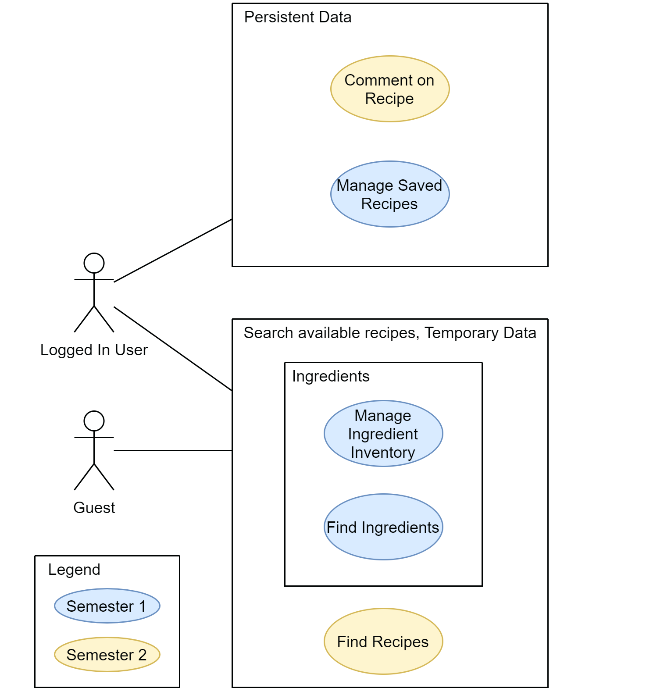

Project - cooken | Software Requirements Specification
======
Version <1.0>
======

- [#Revision History](#-revision-history)
- [1. Introduction](#1-introduction)
  * [1.1 Purpose](#11-purpose)
  * [1.2 Scope](#12-scope)
  * [1.3 Definitions, Acronyms and Abbreviations](#13-definitions--acronyms-and-abbreviations)
  * [1.4 References](#14-references)
  * [1.5 Overview](#15-overview)
- [2. Overall Description](#2-overall-description)
  * [2.1 Vision](#21-vision)
  * [2.2 Use Case Diagram](#22-use-case-diagram)
  * [2.3 Technology Stack](#23-technology-stack)
- [3. Specific Requirements](#3-specific-requirements)
  * [3.1 Functionality](#31-functionality)
    + [3.1.1 Functional Requirement One](#311-functional-requirement-one)
- [3.2 Usability](#32-usability)
  * [3.2.1 Usability Requirement One](#321-usability-requirement-one)
- [3.3 Reliability](#33-reliability)
  * [3.3.1 Reliability Requirement One](#331-reliability-requirement-one)
- [3.4 Performance](#34-perfomance)
  * [3.4.1 Performance Requirement One](#341-performance-requirement-one)
  * [3.5 Supportability](#35-supportability)
    + [3.5.1 Supportability Requirement One](#351-supportability-requirement-one)
  * [3.6 Design Constraints](#36-design-constraints)
    + [3.6.1 Design Constraint One](#361--design-constraint-one-)
  * [3.7 On-line User Documentation and Help System Requirements](#37-on-line-user-documentation-and-help-system-requirements)
  * [3.8 Purchased Components](#38-purchased-components)
  * [3.9 Interfaces](#39-interfaces)
    + [3.9.1 User Interfaces](#391-user-interfaces)
    + [3.9.2 Hardware Interfaces](#392-hardware-interfaces)
    + [3.9.3 Software Interfaces](#393-software-interfaces)
    + [3.9.4 Communications Interfaces](#394-communications-interfaces)
  * [3.10 Licensing Requirements](#310-licensing-requirements)
  * [3.11 Legal, Copyright, and Other Notices](#311-legal--copyright--and-other-notices)
  * [3.12 Applicable Standards](#312-applicable-standards)
- [4. Supporting Information](#4-supporting-information)

# Revision History

-----

|    Date    | Version | Description | Author |
|------------|---------|-------------|--------|
| 15.10.2020 |   1.0   |             |        |

## 1. Introduction

### 1.1 Purpose

This document specifies the requirements for cooken. Cooken is a web app for users to find recipes they can cook with limited ingredients. Here will be specified use cases, functional requirements, reliability, and technologies used.

### 1.2 Scope

This SRS applies to the cooken application. 

In cooken there is only one actor, the user/cook. The user has access to all frontend features of the application.

There are two subsystems:
- Default non logged-in mode: The user can use the recipe search function but cannot save anything
- Personalized logged-in mode: The user can save ingredients and recipes on the server

### 1.3 Definitions, Acronyms and Abbreviations

| Abbrevation | Explanation                            |
| ----------- | -------------------------------------- |
| SRS         | Software Requirements Specification    |
| n/a         | not applicable                         |
| tbd         | to be determined                       |
| JSON        | JavaScript Object notation             |
| HTTP        | Hyper Text Transfer Protocol           |
| ----------- | -------------------------------------- |

### 1.4 References

| Title                                         | Date       | Publishing organization   |
| --------------------------------------------- |:----------:| ------------------------- |
| [GitHub](https://github.com/kuscu0/cooken)    | 21.10.2020 | <Cooken Team>             |
| [Blog](https://cooken264100434.wordpress.com/)| 21.10.2020 | <Cooken Team>             |
| [UCD](use_case_diagram.png)                   | 21.10.2020 | <Cooken Team>             |
| [Use case: find recipes](UC/find-recipes/UC_Find_Recipes.md) | 21.10.2020 | <Cooken Team>             |
| [Use case: choose ingredients](UC/choose-ingredients/UC_Choose_Ingredients.md) | 21.10.2020 | <Cooken Team>             |
| --------------------------------------------- |:----------:| ------------------------- |

### 1.5 Overview

The next chapters describe the intended behavior and used tools/technologies.

## 2. Overall Description

### 2.1 Vision

Cooken helps users find recipes online that only require ingredients the user already has at home. These ingredients can be stored in a user account. In addition recipes can be saved or commented on.

### 2.2 Use Case Diagram

### 2.3 Technology Stack
Frontend Web App:
- React

Backend Server:
- Node.js with Express
- MongoDB Database

## 3. Specific Requirements

### 3.1 Functionality

#### 3.1.1 Login and registration

If the user wants to save data, an account is needed. For the registration a user name, E-Mail and password are needed. For logging in the E-Mail and password are used.

#### 3.1.2 Cooking Inventory

A list that can be edited by the user that holds all ingredients a user has. Each ingredient also has an optional expiration date.

If logged in, it is stored on the server.

#### 3.1.3 Ingredients list

This is a list of all possible ingredients that can appear in an recipe. The user uses this list to add ingredients to the cooking inventory.

#### 3.1.4 Recipe search

The main functions of cooken performs a search on a database of recipes. Recipes which use ingredients that are not in the cooking inventory will be filtered from the results. Optionally ingredients can be specified that have to appear in a recipe.

#### 3.1.5 Save recipes
Internal links to recipes can be stored in a user account as a way to quickly access favorite recipes.

Only available when logged in.

#### 3.1.6 Comment on recipe
The user can comment on recipes. These comment are user private.

Only available when logged in.

## 3.2 Usability

The frontend web app should feel intuitive and use to use. New users shouldn't need any or very little training time.

Most actions (searching for recipes, editing the cooking inventory, accessing saved recipes) should require less than 4 clicks.

Only text search should require keyboard use, all other actions should be possible with a mouse.

The web apps core features should work on mobile devices. Responsive design is optional.

## 3.3 Reliability

### 3.3.1 Uptime

All features should have an annual uptime of at least 98.5 %. Meaning that the application can be down for up to 5.5 days a year.

### 3.3.2 MTTR

During German day time the mean time to repair should be less than 6 hours. During night time repairs are not expected.

### 3.3.3 Bugs

The core functions (searching for recipes, managing the cooking inventory) in the back- and frontend must be bug free

### 3.3.4 Data loss

In case of a user data loss, users should be able to recreate their previous state with little effort.

## 3.4 Performance

### 3.4.1 Response time

The average response time of the server should be less than 50 ms. Intensive operations (recipe search) may take up to 5 s.

### 3.4.2 Total user capacity

The server should be able to store and manage at least 10,000 users.

### 3.4.3 Active user capacity

The server should be able to handle 10 % or 1,000 users actively using the application.

### 3.5 Supportability

We will use the [Google JavaScript Style Guide](https://google.github.io/styleguide/jsguide.html) as a coding standard.

Any libraries used must well accepted and maintained in order to guarantee support in the future. 

### 3.6 Design Constraints

#### 3.6.1 Development Tools

- Git for version control
- JetBrains IntelliJ as an IDE
- YouTrack for project management

#### 3.6.2 Languages and Libraries

- React for the frontend
- Express.js for routing and handling HTTP requests
- MongoDB for databse management

#### 3.6.3 Architecture

The MVC architecture should be used for the frontend.

### 3.7 Online User Documentation and Help System Requirements

The application must have a help page that includes a video explaining the features and UI of cooken. 

### 3.8 Purchased Components

n/a

### 3.9 Interfaces

#### 3.9.1 User Interfaces

The application has the following pages/views:
- Login/Registration
- Cooking inventory: For adding and removing entries
- Search: Displays the result of a search query; has additional options to filter the results
- Saved recipes: Lists recipes saved by the user
- Recipe: Displays information like ingredients, instructions and user comments

#### 3.9.2 Hardware Interfaces

n/a

#### 3.9.3 Software Interfaces

For communications the Express.js library implements the HTTP REST API

MongoDB is used to interact with a NoSQL database.

#### 3.9.4 Communications Interfaces

Communications in an production environment will run over https with an SSL certificate to ensure safe transfer of user data.

Information is in the JSON format.

### 3.10 Licensing Requirements

All tools & libraries must be free for commercial use

### 3.11 Legal, Copyright, and Other Notices

GPL-3.0

#### Summary

Permissions:
- Commercial use
- Modification
- Distribution
- Patent use
- Private use

Limitations:
- Liability
- Warranty

Conditions:
- License and copyright notice
- State changes
- Disclose source
- Same license

[See License](LICENSE)

### 3.12 Applicable Standards

n/a

## 4. Supporting Information

n/a
