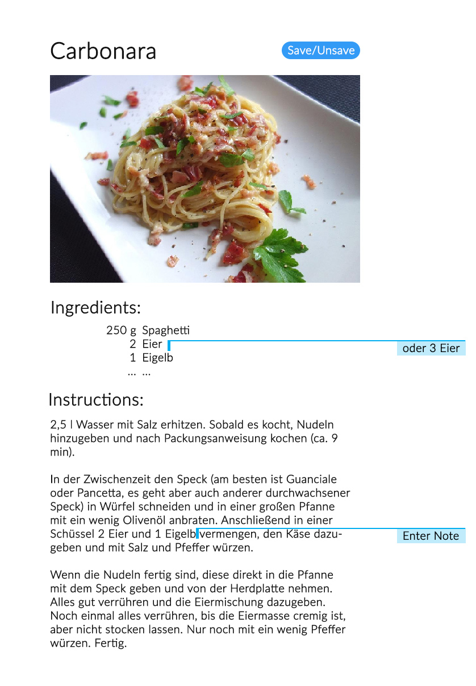
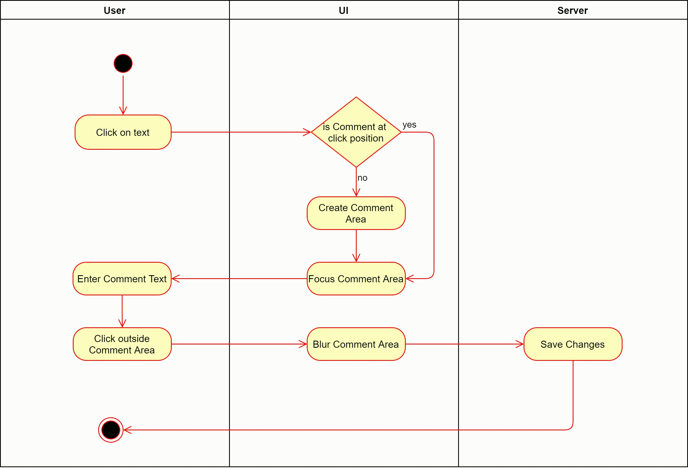

# Use-Case Specification: Comment on Recipe

# 1. Comment on Recipe

## 1.1 Brief Description

A logged in user can add comments to a recipe. 

## 1.2 Mockup

## 1.3 Screenshot
--

# 2. Flow of Events

## 2.1 Basic Flow

### Activity Diagram

### .feature File

[Link](../../features/comment_on_recipe.feature)

## 2.2 Alternative Flows
--

# 3. Special Requirements
--

# 4. Preconditions

The user has to be logged in.

# 5. Postconditions
--

Changes need to be saved on the server.

# 6. Function Points

### Domain Characteristic Table

### Function Points

