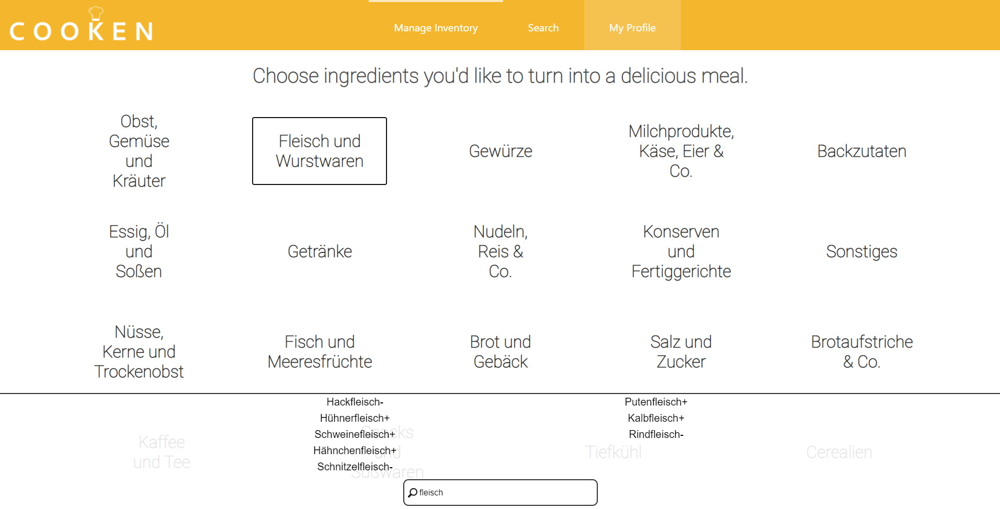
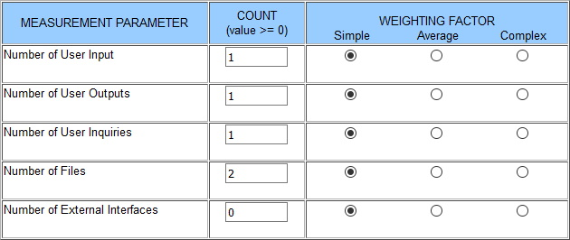
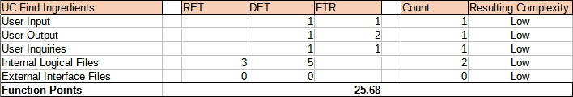

# Use-Case Specification: Find Ingredients

# 1. Find Ingredients

## 1.1 Brief Description

With this use case the user can quickly find ingredients. These ingredients are in a database and categorized. The individual ingredients can then be managed.

## 1.2 Mockup

## 1.3 Screenshot
--

# 2. Flow of Events
--

## 2.1 Basic Flow
--

### Activity Diagram

### .feature File

[Link](../../features/find_ingredients.feature)

## 2.2 Alternative Flows
--

# 3. Special Requirements
--

# 4. Preconditions
--

# 5. Postconditions
--

# 6. Function Points

### Domain Characteristic Table

### Function Points

