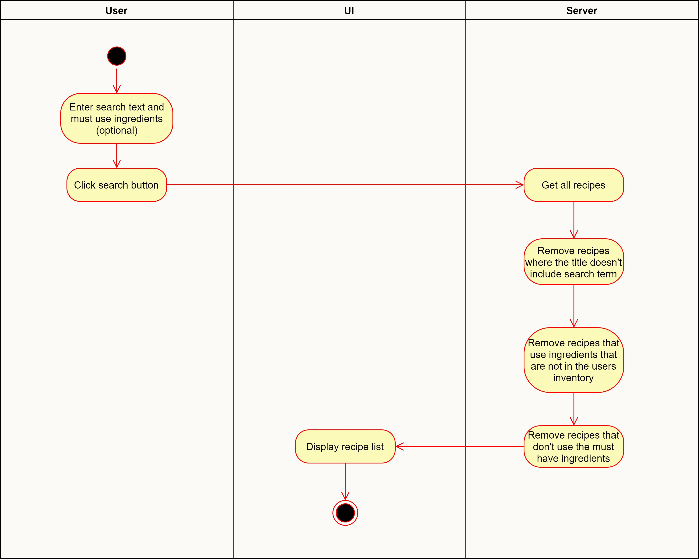

# Use-Case Specification: Find Recipes

# 1. Find Recipes

## 1.1 Brief Description

With this use case the user can search for recipes. Recipes displayed in the results must match the search text, include must use ingredients, and only use ingredients that are in the cooking inventory.

## 1.2 Mockup

## 1.3 Screenshot
--

# 2. Flow of Events

## 2.1 Basic Flow

### Activity Diagram

### .feature File
--

## 2.2 Alternative Flows
--

# 3. Special Requirements
--

# 4. Preconditions
--

# 5. Postconditions
--

# 6. Function Points
--
