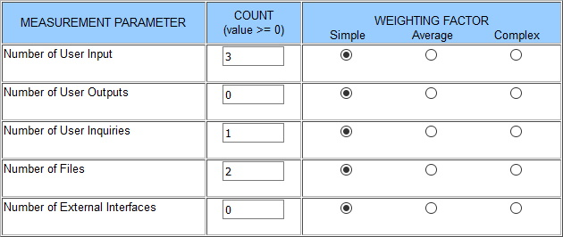
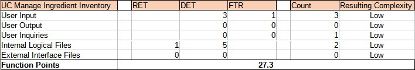

# Use-Case Specification: Manage Ingredient Inventory (CRUD)

# 1. Manage Ingredient Inventory

## 1.1 Brief Description

Users can add and remove ingredients from a predefined list. Added ingredient will be added to the users inventory.

## 1.2 Mockup

## 1.3 Screenshot
--

# 2. Flow of Events

## 2.1 Basic Flow

### Activity Diagram

### .feature File

[Link](../../features/manage_ingredient_inventory.feature)

## 2.2 Alternative Flows
--

# 3. Special Requirements
--

# 4. Preconditions
--

# 5. Postconditions
--

# 6. Function Points

### Domain Characteristic Table

### Function Points

