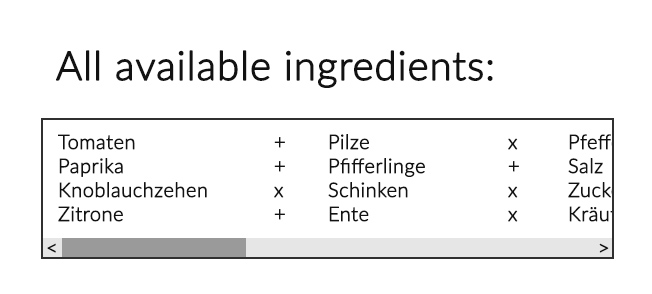
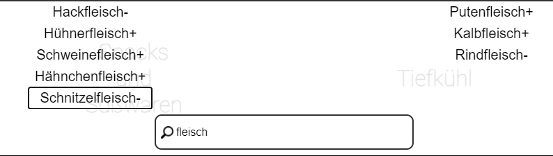
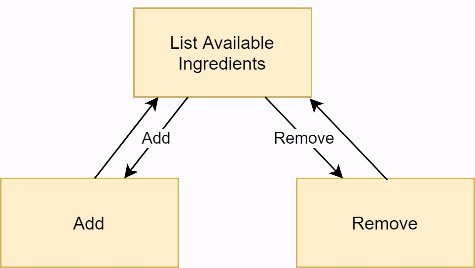

# Use-Case Specification: Manage Saved Recipes (CRUD)

# 1. Manage Saved Recipes

## 1.1 Brief Description

A logged in user can save and unsave recipes. Saved recipes can be listed on a page. 

## 1.2 Mockup

## 1.3 Screenshot
--

# 2. Flow of Events

## 2.1 Basic Flow

### Activity Diagram

### .feature File
--

## 2.2 Alternative Flows
--

# 3. Special Requirements
--

# 4. Preconditions

The user has to be logged in.

# 5. Postconditions
--
